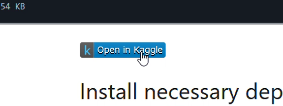

# Text-Sentiment-Analysis

This is a simple project that implements text sentiment analysis. Sentiment analysis is a machine learning technique that determines whether a given text expresses a positive or negative sentiment. Based on the user's input, the model classifies the text and outputs either "positive" or "negative."

## Algorithm ⚙️
The algorithm used in this model is **logistic regression**, provided by the **Scikit-learn** library. Logistic regression is one of the simplest and most efficient algorithms for handling text sentiment analysis.

## Dataset 🍟
The dataset used in this project is the **IMDB (Internet Movie Database) dataset**, which can be obtained from the [**Hugging Face Datasets library**](https://huggingface.co/docs/datasets/).

## Deployment 🎁
The trained model is available in `.pkl` and `.onnx` file formats.  
(Note: The ONNX version has not been tested yet, so it may contain errors or compatibility issues.)  

You can find all model files in the [**model**](model/) directory. If you're interested in understanding the model logic, check out the Jupyter Notebook in this repository or click this link 👉🏻 [here](notebook.ipynb). You can also customize it with your own dataset or modify the model logic to improve performance.

> [!TIP]
> To open the notebook without worrying about project setup and dependencies, simply use the **Open in Kaggle** widget. This will launch the notebook directly in your Kaggle account.
> 

## Web App Implementation 🌐
If you want to see how the model is deployed in a real application, check out the [**web**](web/) directory, which contains the source code for the web app. The web app is built using **Flask**, a lightweight Python framework.

Currently, I am working on deploying the model in a way that allows it to run directly in the client’s web browser, eliminating the need for a Flask-based backend server. Unfortunately, I haven't been able to achieve this yet due to some errors in the code.  

For more details on the current issues, please check the **Issues** tab in this repository.

---

